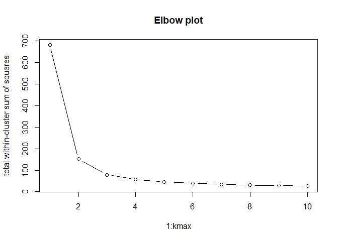

<!-- README.md is generated from README.Rmd. Please edit that file -->
analysistools
=============

This is a personal package gathering some functions I frequently use in analysis. Rather than searching for them, or remaking them time after time, I will be packaging them up here.

Installation
------------

And the development version from [GitHub](https://github.com/) with:

``` r
# install.packages("devtools")
devtools::install_github("suzanbaert/analysistools")
```

Clustering functions
--------------------

Get the kmeans elbow plot:

``` r
kmeans_elbow(iris[-5])
```



Or get a second opinion on the number of clusters via Silhouette analysis. This shows the average silhouette width for each number of clusters.

``` r
silhouette_plot(iris[-5])
```


<br>
<hr>
<br>

Plotting functions
------------------

-   `ggplot_colors(n)` gives the HEX codes of ggplot colors
